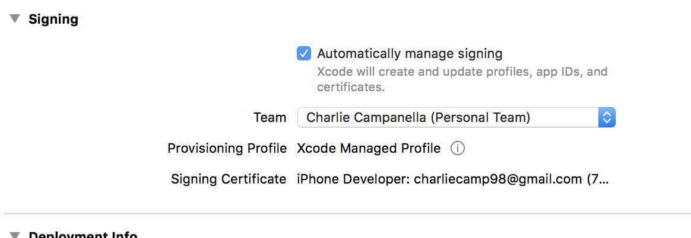

# Ionic 3 Tutorial

## Part 0: Introduction to Ionic

Ionic is a free and open source framework used to build progressive web and native mobile applications.
The framework empowers web developers to build apps for all major app stores and the mobile web with a single code base.

A powerful command-line-interface (CLI) coupled with a pre-built UI kit, 120+ native APIs, and a strong developer community makes building applications with Ionic a breeze.

Ionic is powered by Google's popular **Angular** framework and Microsoft's **TypeScript** superset of Javascript. This tutorial assumes that you have at least a bit of prior experience with these technologies. If not, please consider using the following resources to familiarize yourself:

### Angular Resources

* [Official Documentation](https://angular.io/docs)
* [60 Minute Crash Course](https://www.youtube.com/watch?v=KhzGSHNhnbI&t=54s)
* [Angular-SF MeetUp (Bay Area)](https://www.meetup.com/Angular-SF/)

**Please Note:** When studying Angular, be sure to read up on **Angular 2.x, 4.x, or 5.x+**. Angular 1.x is an entirely **different** framework that utilizes an MVC-based architecture instead of an (oftentimes considered more scalable) component-based architecture.

### TypeScript Resources

* [Official Documentation](https://www.typescriptlang.org/)
* [45 Minute Crash Course](https://www.youtube.com/watch?v=rAy_3SIqT-E)

## Part 1: Installing Ionic

Most Ionic CLI tools are based on Node.js, with dependencies being managed through the Node Package Manager (NPM). As such, Node and NPM must be installed on your system before continuing.

Install Node and NPM with the [Node.js Installer](https://nodejs.org/en/)

Now that Node and NPM are set up, run the following command to install the Ionic and Cordova CLI.

```
npm install -g ionic cordova
```

> Apache Cordova (also known as PhoneGap) is a framework that provides web applications access to native mobile device APIs and bundles them for distribution on various app stores. Ionic is built on top of Cordova.

After installing the aforementioned command line interfaces, you can instantiate your first Ionic Application with the following command:

```
ionic start appName blank
```

> Note that Ionic provides various [Starter Templates](https://ionicframework.com/docs/cli/starters.html). In this case, we are using a blank template that is ready for customization.

Now that you've instantiated your application, cd into the **/appName** directory that was created and execute the following command to test your app in the browser. (LiveReload Included!!!)

```
ionic serve
```

### Testing on iOS

**Note: You must have an Apple computer with xCode installed to test on iOS**

To test on iOS, you must install the ios-deploy Cordova platform.

```
npm install -g ios-deploy
```

Next, open the config.xml file located in your project's root directory and change the **<widget>** id to a unique string. Something like:

```
<widget id="com.appName.app" ...>
```

Then, run the following command:

```
ionic cordova platform add ios
```

Once this command is finished running, you can then cd into **/platforms/ios** and open the **appName.xcodeproj** file. Sign into your Apple Developer account and select a development team.


